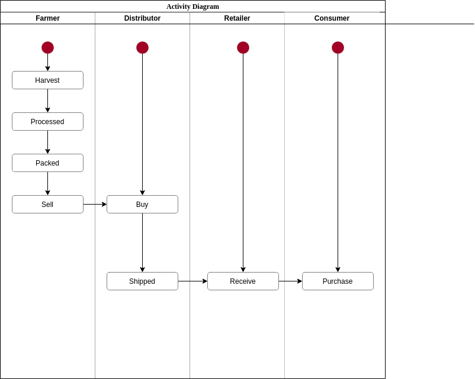
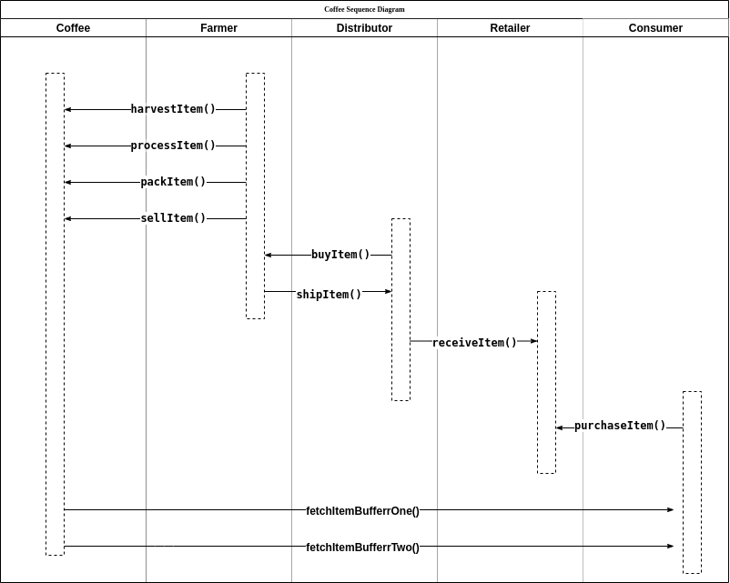
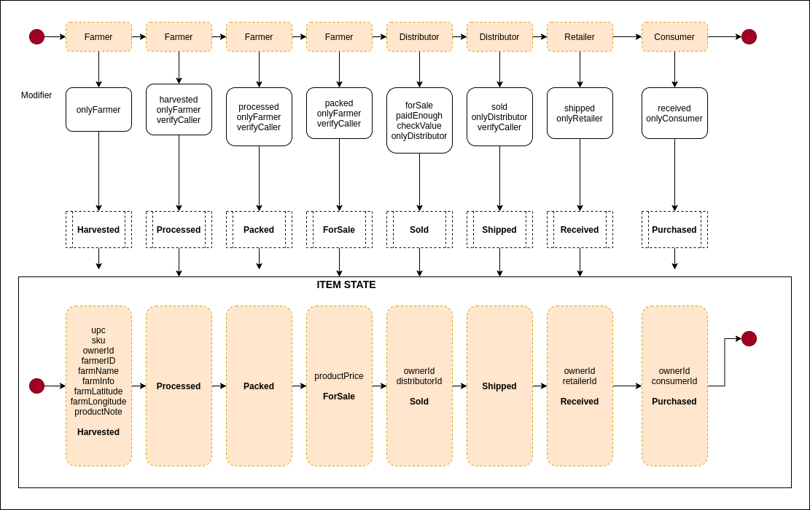
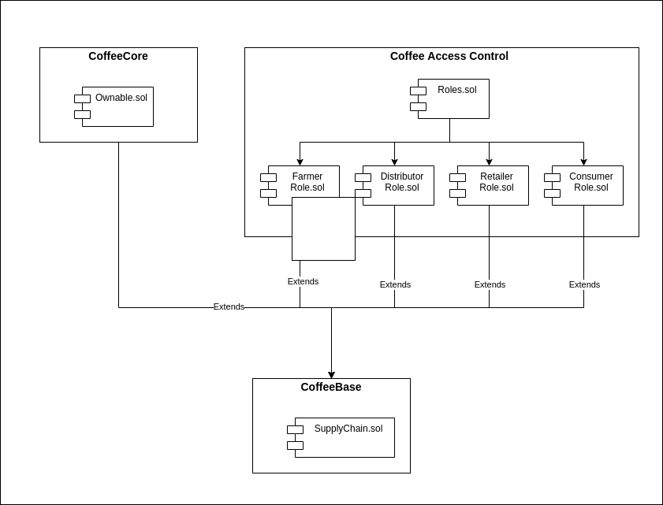

# Supply Chain

## Libraries and Framework  
The project is built with:
```
    Truffle v4.1.17 (core: 4.1.17)
    Solidity v0.4.26 (solc-js)
    Node v11.15.0
```

## Contract on ropsten
                        
    Transaction Hash: 0x29329c265b499f2f1b87d2f765159fd2b19d91a21ec3a4736c9e33826db9bba1
    Contract address: 0xd1a86383caff95f076d371c21472628ee5ab8448
                        
## How to run:
    ```
    git clone https://github.com/lambdanetwork/blockchain_ND_supply_chain.git
    npm install
    npm run dev
    go to localhost:3000
    ```
    
    Do not forget to switch accounts in Metamask, while acting on behalf of the buyer

## How to Debug:
    ```
        1. using browser goto localhost:3000
        2. when executing any action, pay the gas-price
        3. after succeeed or failure notification, open developer-tools
        4. on the console.log, get the transaction-block
        5. https://ropsten.etherscan.io/address/0xfb0720c0715e68f80c0c0437c9c491abfed9e7ab#code
    ```

## How to run automated test?
    ```
    truffle develop
    truffle migrate --network ropsten
    truffle test --network ropsten
    ```

## Diagrams

### Activity Diagram

<br />


### Sequence Diagram

<br />


### State Diagram

<br />

### Class Diagram

<br />